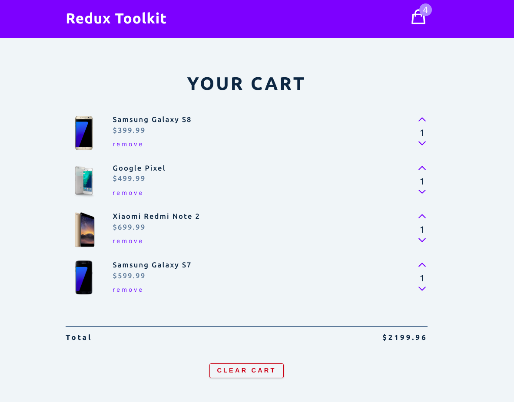
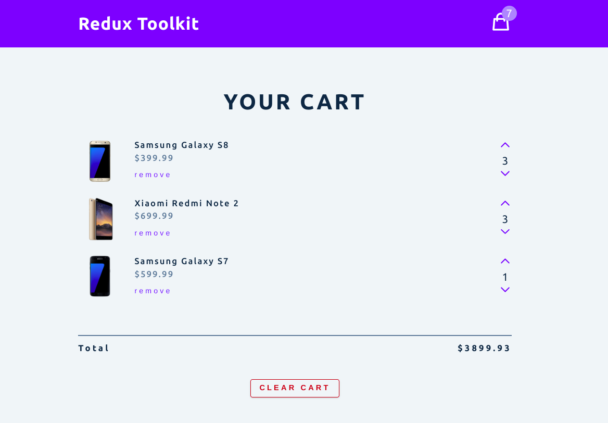
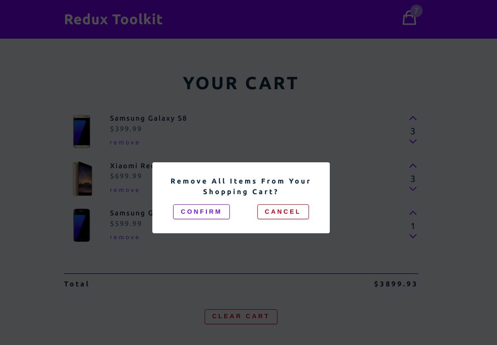
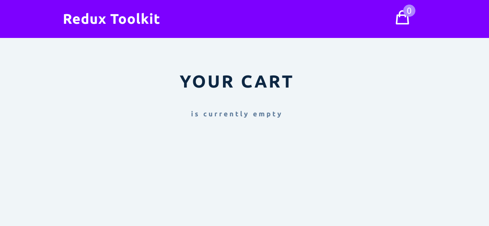

# Simple Cart

A toy project from John Smilga's [course](https://www.udemy.com/course/react-tutorial-and-projects-course/) to learn the very basic of Redux Toolkit

## Screenshots

### Preview

### Change amount of items in cart

### Clear modal

### Cart cleared

